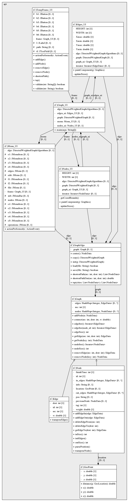

# Ex2

This is our project on graph algorithms (specificly directed weighted graphs) and GUI in java. it can be used to run
different algorithms on graphs using a simple graphical user interface

## Description

This is our project for implementing graph algorithms on directed weighted graphs and presenting them wth GUI in java.
Our application can parse json files into graphs on which they can do different operations and modifications to the
graph.

Our project support commonly used graph algorithms such as:tsp (a simplified variation of tsp), isConnected
(meaning is this graph strongly connected), center (finding the center of the graph), Shortest Path (find the shortest
path between two vertices) and Shortest Path Distance
(find the distance between two nodes)

it also supports saving and loading graphs from and to json files
(Note: The json file structure should look like those in the data folder when trying to load them)

## Table of contents

1. [Getting started](#Getting-started)
2. [technologies](#Technologies)
3. [functionalities](#Functionalities)
4. [sources](#Sources)
5. [runtimes](#Runtimes)
6. [UML](#UML-image)

# Getting started

1. Download or clone this repository and find the "`Ex2.jar`" file.
2. Run the command line and in the directory of the jar file, then make sure that you know the path to your json file or
   that the json file is at the "`data`" or "`saved_graphs`" directory of this repository
   (these are the default directories in which the program searches for json files)
3. In the command line write "`java -jar Ex2.jar {path to your json file}`" and the program will run and the json file
   will be loaded. if you have the json file in the default directories you can simply write its name and the json will
   be loaded. (in both ways please also write the json file extension at the end i.e. "`path/to/file.json`"
   or "`file.json`")

# Technologies

* java jdk 17.0.1
* GSON 2.8.9

# Functionalities

Our project supports algorithms on graphs that are weighted and directed, hence all algorithms mainly work on these
types of graphs.

### main algorithms:

* **tsp**: this algorithm isn't exactly tsp but a variation of it that finds the shortest route between a subset
  vertices. the algorithm we used is not that fast but its does find a path (if it exists) in a reasonable time.
* **shortestPath**: this algorithm is used to find the route with the lowest sum of weights (shortest path) between two
  verices. it's very similar to the bellman-ford algorithm, but it also keeps track of the route that we went through to
  reach the destination node and how much did it "cost" (or what is the distance from te source node to the destination
  node).
* **shortestPathDist**: This algorithm is used to find the distance between two vertices. This algorithm uses the
  shortestPath algorithm and just returns the length of the route (the sum of the weights in the route).
* **isConnected**: This function is used to check if the given graph is strongly connected. meaning that every vertex on
  this graph can reach any other vertex in the graph (in other words, there is a path between every two vertices in the
  graph). ths function uses topological sort to see if there is a vertex that all nodes can reach and that it can reach
  all nodes.
* **center**: This algorithm finds the center of the graph (if it exists, meaning if the graph is strongly connected).
  the center of a graph is the vertex that the distance from it to the farthest vertex from it is minimal. this
  algorithm uses djikstra's algorithm to find the farthest vertex from a given vertex.

**all these algorithms can be found in the menu-bar under "operations".**

### graph modifications

you can also add and remove vertices and edges simply with the GUI

* **add node**: In the GUI, go to Edit -> add node, and press on the screen where you want to add that new node.
* **remove node**: In the GUI, go to Edit -> remove node, and type the id of that node (the node's id is the blue number
  that appears above it).
* **add edge**: In the GUI, go to Edit -> add edge, and type "src,dest,weight" ("src" and "dest" are id's of the nodes
  and weight is the weight of the graph).
* **remove edge**: In the GUI, go to Edit -> remove node, and type "src,dest"

### saving and loading graphs

* **saving**: To save a file go to File -> Save, then choose where to save your graph (graphs are saved in json format)
* **loading**: To load a graph you can do two things. the first is to type the entire path of that file. the second way
  is to put the graph's json file in the "data" or the "saved_graphs" directories and then simply write only it's name
  with json extension.
  (the "data" and "saved_graphs" directories are the main directories to search for graphs)

# Sources

* **Djikstra's algorithm**: https://en.wikipedia.org/wiki/Dijkstra%27s_algorithm
* **Bellman-ford algorithm**: https://en.wikipedia.org/wiki/Bellman%E2%80%93Ford_algorithm
* **Topological sort**: https://en.wikipedia.org/wiki/Topological_sorting
* **BFS**: https://en.wikipedia.org/wiki/Breadth-first_search

# Runtimes

The graphs that were tested in this test case are:

* G1.json
* G2.json
* G3.json
* CustomGraph.json (variation of G1)
* 1,000Nodes.json (custom graph, could not upload to this repo because it was too big)
* 10,000Nodes.json (custom graph, could not upload to this repo because it was too big)

All graphs were tested at once. Runtime results are for the given graphs in the same order  
Each test was executed immediately after the previous test was done.  
**Results:**

  

# UML image

